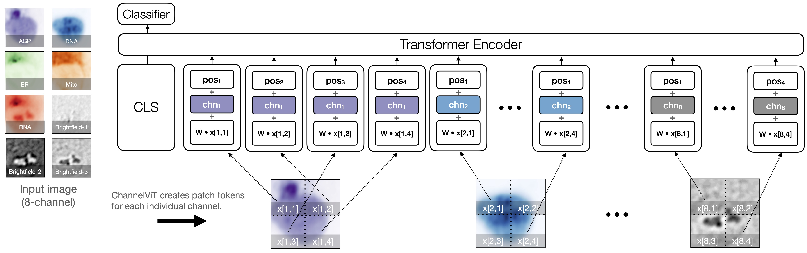

## ChannelMAE (Masked Autoencoders + Channel Vision Transformer): A PyTorch Implementation

### Masked Autoencoders
Masked Autoencoders Are Scalable Vision Learners

  

### Channel Vit

Channel Vision Transformer: An Image Is Worth C x 16 x 16 Words

<figure>
  

  
  

  <figcaption width=80%><em>
  Illustration of ChannelViT. The input for ChannelViT is a cell image from JUMP-CP, which comprises five fluorescence channels (colored differently) and three brightfield channels (colored in B&W). ChannelViT generates patch tokens for each individual channel, utilizing a learnable channel embedding </em><b>chn</b><em> to preserve channel-specific information. The positional embeddings </em><b>pos</b><em> and the linear projection </em><b>W</b><em> are shared across all channels.
  </em></figcaption>
</figure>
 
 

This is based on `MAE` and `Vit` implementation https://github.com/facebookresearch/mae, modified to add `ChannelVit` and `ChannelMAE`

### Contributions

- [x] Pre-training code for MAE and ChannelMAE
- [x] Fine-tuning code for Vit and ChannelVit (encoders of MAE and ChannelMAE)
- [x] Linprobe code for Vit and ChannelVit (encoders of MAE and ChannelMAE)

We implemented `ChannelMAE` in `models_chamae.py`
We implemented `ChannelVit` in `models_vit.py`

### Visualization demo

Run our interactive visualization demo using [Colab notebook](https://colab.research.google.com/github/facebookresearch/mae/blob/main/demo/mae_visualize.ipynb) (no GPU needed):

  

### Pre-training

The pre-training instruction is in [PRETRAIN.md](PRETRAIN.md).

### License

This project is under the CC-BY-NC 4.0 license. See [LICENSE](LICENSE) for details.
